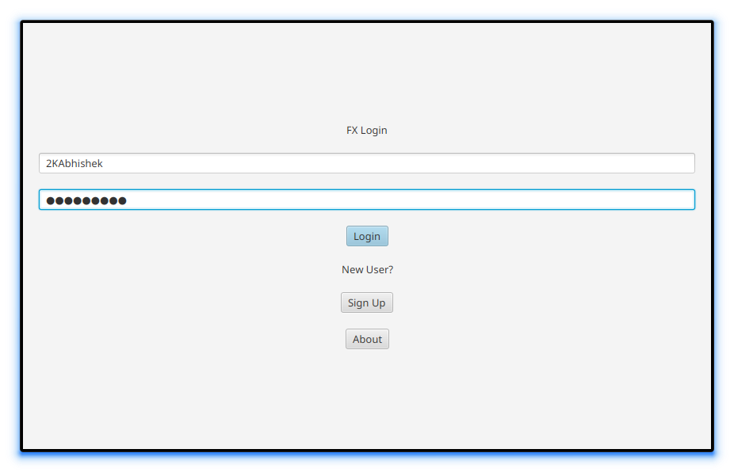

<div align = "center">

<h1><a href="https://2kabhishek.github.io/fx-login">FX Login</a></h1>

<a href="https://github.com/2KAbhishek/fx-login/blob/main/LICENSE">
 </a>

<a href="https://github.com/2KAbhishek/fx-login/pulse">
 </a>

<a href="https://github.com/2KAbhishek/fx-login/stargazers">
</a>

<a href="https://github.com/2KAbhishek/fx-login/network/members">
 </a>

<a href="https://github.com/2KAbhishek/fx-login/watchers">
 </a>

<a href="https://github.com/2KAbhishek/fx-login/graphs/contributors">
 </a>

<a href="https://github.com/2KAbhishek?tab=followers">
 </a>

<h3>Reusable JavaFX Login Module 🔑🔓</h3>

<figure>
  
  <br/>
  <figcaption>fx-login screenshot</figcaption>
</figure>

</div>

## What is this

This is a reusable JavaFX login module.
It is a plugin module that can be used to create a login screen in any JavaFX app.

## Inspiration

Was working with some JavaFX apps, needed a reusable login module.

## Prerequisites

Before you begin, ensure you have met the following requirements:

- You have installed the latest version of `JavaFX`, `Java`.

## Getting fx-login

To install fx-login, follow these steps:

```bash
git clone https://github.com/2kabhishek/fx-login
cd fx-login
```

## Using fx-login

This can used as a starting point for your own login module.

## How it was built

fx-login was built using `VS Code`, `JavaFX`, `Java`.

## Challenges faced

Setting up JavaFX was a bit tricky.

## What I learned

- Learned about the `JavaFX` ecosystem and how to use it.
- Used FXML and SceneBuilder for Scene creation.

Hit the ⭐ button if you found this useful.

## More Info

<div align="center">

<a href="https://github.com/2KAbhishek/fx-login">Source</a> | <a href="https://2kabhishek.github.io/fx-login">Website</a>

</div>
